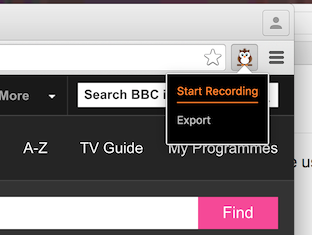

# Nightingale
A Chrome Plugin, based on [resurrectio](https://github.com/ebrehault/resurrectio),
to write simple user-based tests.



## Setup
First checkout the repository,
```bash
git clone https://github.com/charlier/nightingale
```
* In Chrome, navigate to chrome://extensions/
* Check the 'Developer Mode' option is ticked
* Load the extension via the 'Load unpacked extension' button
* A little owl will help guide you on your way

## TODO
* Take screenshot currently does nothing
* Hook up screenshot diffs (https://gist.github.com/richard-flosi/8a5d2e10b6609ab9d06a)
* Some interactions randomly stop recording
